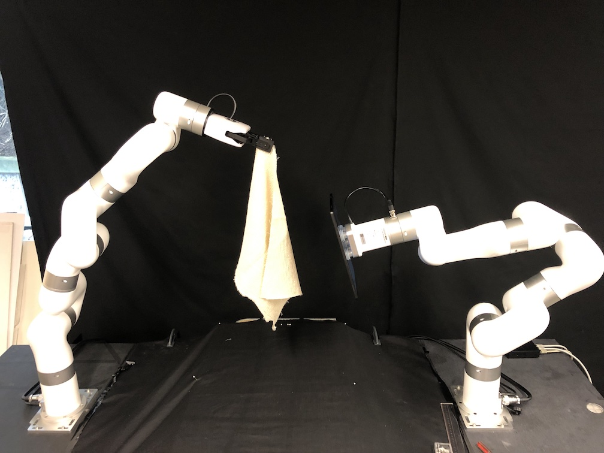
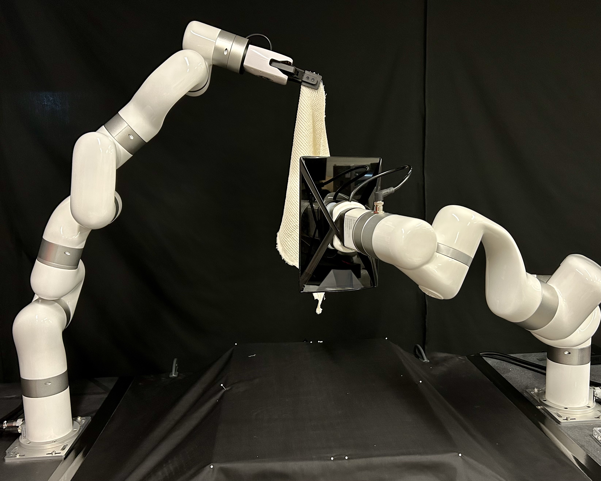
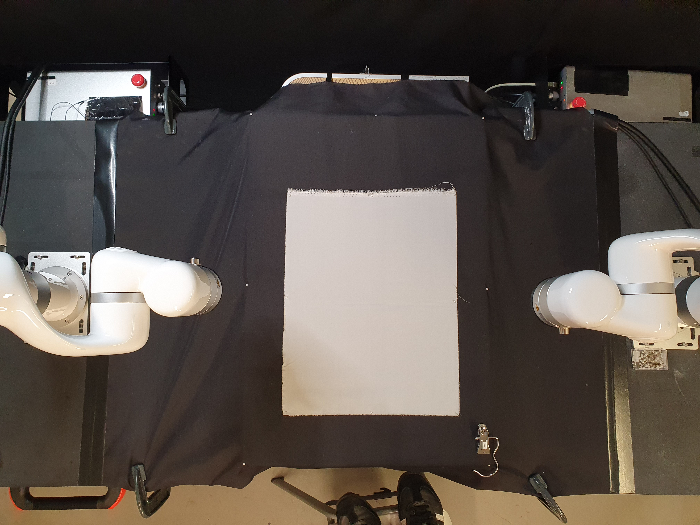
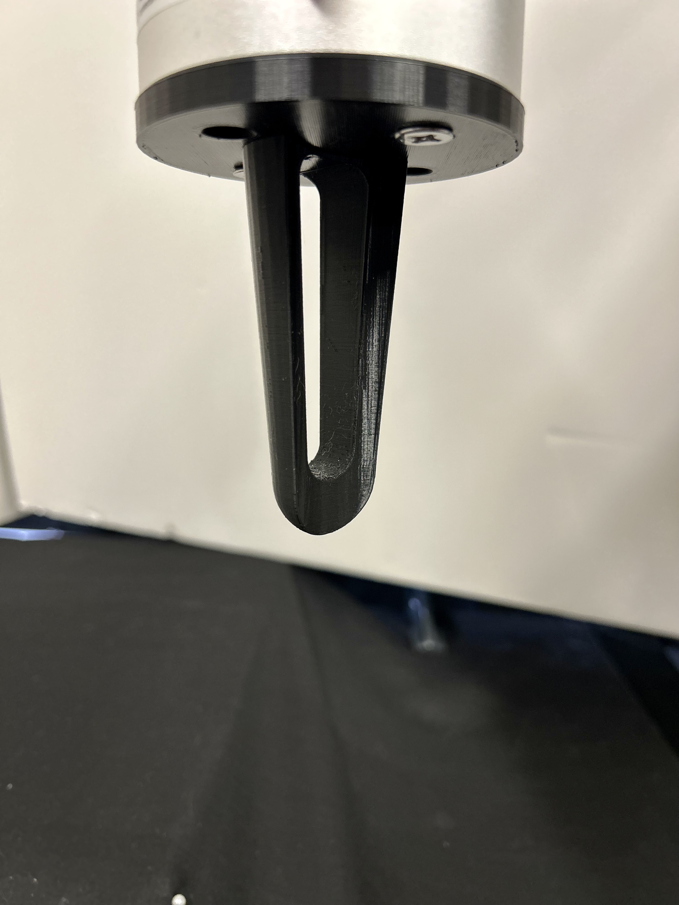
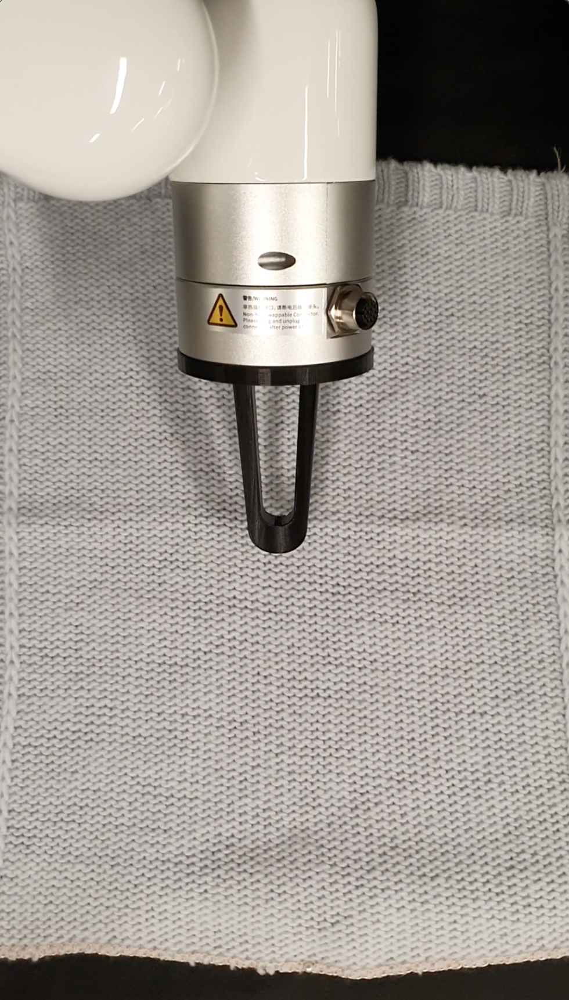
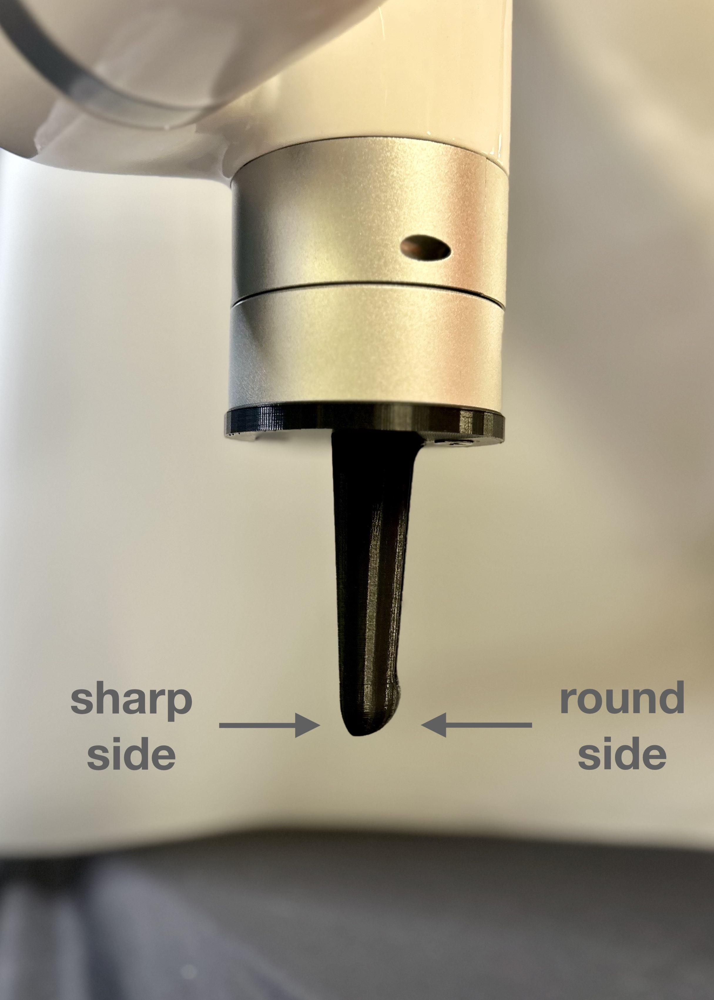

# Textile Robotic Interaction Dataset for Designer Robot Collaboration (HRI 2024)

This repository stores the scripts and text-based data for a collaborative experiment conducted in July 2023 between two research projects, Intelligent Design Systems for Innovation (RP2-5) at the Royal College of Art, London, UK and Human-centred AI Design (RP2-4) at The Hong Kong Polytechnic.  Both projects are funded by the [Laboratory for Artificial Intelligence in Design](https://www.aidlab.hk/en/) under the InnoHK Research Clusters, Hong Kong Special Administrative Region Government.

There were two robotic experiments.  Both had the general aim of scanning and recording image-based / video data of textile materials.  The set of 12 novel sustainable textile materials used in these experiments was provided by the RP2-5, sourced from via [Sustainable Angle](https://thesustainableangle.org/) from their Future Fabric Material Library.   RP2-4 provided access to UFactory xArm7 robot arms at the human-robotic collaboration lab.

## Data
*A sample selection of data is available in the ```data``` directory, in this repository.*  The full data is available as a .zip from this link. Un-zip this directory and replace the ```data``` directory.  

## Research Paper
A research paper is available, published as a Late-Breaking Report submitted to Human-Robotic Interaction Conference 2024. ***link to submitted research paper***, which
describes the set-up to the experiments.  This document describes technical details, such as file formats and the scripts used to run the robot experiments.


## Experiments

### Experiment 1: Robotic Textile Scanning



The idea in this experiment was to have a robot methodically scan a draped fabric (held by another robot arm).  One robot holds the fabric in a static draped position.  The other robot arm then follows a static pre-programmed path with a tablet device attach on its end effector.  The device runs an image acquisition app that records time-stamped images at regular intervals (about 100ms).  One of the aims is to automatically boost the number of images acquired of textile's in a consistent and repeatable manner and path pattern.  

#### Defining the Path
The robot paths were created manually, where key-points were recorded around the draped fabric and using the xArm's API, a linear path was interpolated (at a given speed) for the robot to guide the image-recording app.

Positions were defined from the perspective of the camera application, experimentally (with the ```robot_calibration.ipynb``` Notebook).  Four core positions were defined:

- ***Top Center*** (where the camera was positioned where the other robot held the fabric),
- ***Center Center*** (camera positioned directly at the center of the fabric),
- ***Center Right***, and
- ***Center Left*** (camera positioned on the Right and Left facing the center height of fabric).


These four positions were defined for four levels of proximity to the fabric's surface (roughly stepped by 5-10mm): *close*, *mid*, *normal*, *far*.  There were super far center positions to acquire images as far back as the scanning robot allowed.  With these positions defined, a path (an ordering of these positions) was defined.  For running experiments, this path was defined in the scan.py script, which also exported time-stamped data for each experiments.




#### Running the Experiments

Each of the 12 Future Fabric Expo fabrics were scanned.  The scanning robot moved from path position to position at a speed of 50 (as defined in the xArm API), and at each position the robot would pause for 1 second before moving to the next position.

For each scan, the tablet-based image recording app recorded images a "full" resolution which was 1072x1072 pixels and an "input" resolution 320x320 pixels which is a centered cropped region.  The scanning was using the same routine as in the AiLoupe application for it's image aquisition.

In addition, while scanning, the robots recorded their positions (broadcast from a network socket from each of the robot arms).  These position frames were recorded at roughly ~100ms interface, using the report.py script.  Since there are two robot arms, for each scan both robot's positions were recorded (the fabric holding robot was static for the entire scan).  

In order to mark-up the scanning routine and align with timestamps, the scan.py script recorded the timestamp as the robot moved from position to position.  These timestamped markers were exported at the end of each scan.

Finally, a top-down mobile camera recorded each experiment, providing an overhead video of the scan.  

#### Experiment Results

Each fabric had at least 1 scan.  Fabric 12 (FFE_12) had issues with the first scan, and thus a second scan was recorded, and thus there are two sets of data for that fabric.  Fabric 3 (FFE_03) ended up being scanned twice, however, both scans were partially recorded.  The tablet-based scanning app ended up having memory leak issues (and filling up it's internal memory) that towards the last scans, the rate of image recording really dropped to infrequent and crashed.  


#### Data Organisation

The ```data/scans``` directory is organisted by material:

    data/scans/ffe_01
    └── 1                              <--- scan number
        ├── 20230720_152330.mp4        <--- overhead video
        ├── images                     
        │   ├── full                   <--- scan images at full resolution
        │   │   ├── 20230720082025734.jpg
                ...
        │       └── 20230720082820661.jpg
        │   └── input                  <--- crops of full resolution images
        │       ├── 20230720082025734_input.jpg    
                ...
        │       └── 20230720082820661_input.jpg
        ├── report_192.168.1.225_20230720153145.json <--- robot left arm dynamics
        ├── report_192.168.1.244_20230720153143.json <--- robot right arm dynamics
        └── scan_20230720153134.json                 <--- scan file


#### Note on timestamps

All of the data was captured independently.  The video file, start/end times of the scan, and the reports are manually started/stopped.  That means the lengths of the data capture will vary and is not in sync.  

The image timestamps (file names) are in a different timezone to that of the video files and the recorded json files.  The report/scan timestamps are recorded on the same computer, so their timings are relative to each other.

#### Scan file format

The scan file records timestamps for when the experiment starts and as the moving arm changes positions.

Here is an example file:

    {
      "name": "ffe_1",
      "progress": [
        {
          "i": 0,
          "move": "center_center",
          "current_pos": [
            0,
            [
              479.599365,
              44.405903,
              839.999634,
              179.999963,
              -69.999973,
              0
            ]
          ],
          "datetime": "2023-07-20 15:23:48.397563"
        },
        ...
      ],
      "start": "2023-07-20 15:23:48.396867",
      "end": "2023-07-20 15:31:34.079283"
    }

##### name
Material name

##### progress
Array of steps of moves of the robot during the scanning routine

##### start
Start experiment timestamp

##### end
End experiment timestamp (not necessarily in sync with video or other files)

##### progress.i
Step in progress

##### progress.move
Name of step in progress

##### progress.current_pos
Position array for 6-DOF, format: ```[0, [x,y,z,rx,ry,rz]]``` (r* are the rotations about the xyz axes).

##### progress.datetime
Timestamp of the step in the progress

#### Report File Format
Report file is a data capture of the robot arm dynamics while the robot is in operation.  This is done via running the ```report.py``` script, which listens to the TCP port on the robot arm on which continuous reporting o the angles and poses of the robot arm.

Robots are identified by IP address, in the scanning experiment the "left" robot's (facing the set-up) IP address ends in 225.  This robot was holding the fabric and was still during the scan.  The "right" robot (IP ends in 244) was holding the tablet and was moving during the scanning process.

Example file format:

    {
      "ip": "192.168.1.225",
      "data": [
        {
          "timestamp": "2023-07-20 15:23:38.707009",
          "total": 145,
          "data": "b'\\x00\\x00\\x00\\x91\\x02\\x00\\x00fO\\xfb>\\xe7\\x91\\xf4>\\xff:\\x90\\xbf4\\xee*@\\xa3\\xa8??Z\\xf8\\x90?e\\xff\\xc5@\\xb8\\xcc\\xefC\\xa5\\x9f1B\\xfa\\xffQD\\xd6\\x0fI@\\xa7a\\x9c\\xbf]\\x0b\\x035kx\\xc4(fS\\xa8\\xc1O\\\\R\\xc0\\xe5\\x9d\\xe1@\\x8f\\x08\\x14>\\xe5=\\x0c\\xc06\\xd3-<\\x7f\\x7f\\x00\\x00\\x00\\x00\\x00\\x00\\x00\\x00\\x00\\x00\\x00\\x00\\x00\\x00\\x00\\x00\\x00\\x00\\x00\\x00\\x00\\x00\\x00\\x00\\x00\\x00\\x85\\xebQ?\\x00\\x00\\x00\\x00\\x00\\x00\\x00\\x00\\x00\\x00@B\\x03\\x03\\x00\\x00\\x00\\x00\\x00\\x00\\x00\\x00\\x00\\x00\\x80\\xbf'",
          "angles": [
            0.4908401370048523,
            0.4776756465435028,
            -1.1268004179000854,
            2.6707887649536133,
            0.7486669421195984,
            1.1325790882110596,
            6.1874260902404785
          ],
          "poses": [
            479.599365234375,
            44.40590286254883,
            839.9996337890625,
            3.1415915489196777,
            -1.22173011302948,
            4.881783866039768e-07
          ]
        },
        ...
      ]
    }

##### ip
Identifies the robot

##### data
Array of reporting frames (about one every 200ms)

##### data.timestamp
Datetime of the report data at the time of capture (by the script)

##### data.data
Raw byte-string of the data captured

##### data.total
Total number of bytes of data

##### data.angles
Unpacked data, to the 7 servo angles of the robot

##### data.poses
Unpacked data, the 6-DOF pose (x,y,z,rx,ry,rz)

### Experiment 2: Robotic Handfeel Experiment

This experiment was inspired by videos of fabric handling used by fabric suppliers to convey the handfeel of the material.  As opposed to displaying static images of their fabrics, a video (https://www.upwhk.com/shop/commodity/1140) showing a standard set of gestures of a hand interacting with the fabrics is displayed. In this experiment, we program two robot arms to replicate a very simple gesture of two thumbs rubbing the surface of a fabric.  This is recorded by video from two perspective - top-down and side-angle view.

#### Set-up

Two robot arms are positioned symmetrically over a work area.  The work area is roughly 20cm by 30cm and the surface is a hard packing foam, which allows the robot to press into the fabric and with some give.  



The robots interact with the fabric with a static end-effector "thumb", made of 3D printed ABS plastic.



In this experiment the thumb is rotated to roughly 45 degrees from the surface of the fabric and moves in a "pulling" motion along various axes.  



Because the aim it to replicated a "pulling apart" gesture, both robot arms move their thumbs in synchronous and symmetrical motions.  

The thumbs have two-sides to them, and the experiments are repeated for each side.  One side is the rounded side of the thumb, and the other is a "sharp" nail side of the thumb.  In early tests we found the sharp side to have more pull on the fabric, and to create a variation of interactions of the thumb with the fabric, ran experiments with both sides.



#### Defining the Gestures

The robot arms conducted three different types of "pulling" motions on the fabric, each along 3 axes: ***X***, ***Y***, ***XY*** (in a diagonal direction).  For directional fabrics, this mean that the motion was applied in both the warp and weft direction, as well as a 45 degree diagonal.

For each "pulling" motion, the robot arms applied increasing pressure of the thumb into the fabric material.  This was done by setting the ***Z*** height of the thumb onto the fabric from barely grazing the surface of the fabric, and linearly incrementing the ***Z*** position of the thumbs in multiple passes.

#### Running the experiments

All 12 fabrics were tested in this handfeel experiment.  A fabric was tested twice, one for each side of the fabric, designating one side ```A``` and one side ```B``` (this was done without defining an "inner" or "outer" side of the fabric.

The fabrics were pinned down to the foam surface of the work-area at each corner and side.  For each fabric, the pulling motion is applied along the 3 directions for 5 increasing levels of pressure (note: initially this was set to 3 levels, but after running through a few fabrics, it was decided to do 5 passes, and re-run the initial fabrics).  This routine is repeated for both ends of the thumb: "round" and then "sharp".

One fabric material (number 8 the coconut leather) began to be scratched severely the increasing levels of pressure, and the motions were cut off early to prevent destroying of the material.

#### Data collected

For a single material, the following data was collected:

    ffe_09
    ├── A
    │   ├── 20230728_162655.mp4
    │   ├── IMG_4640.MOV
    │   ├── IMG_E4640.MOV
    │   ├── handfeel_20230728163039.json
    │   ├── report_192.168.1.225_20230728163042.json
    │   └── report_192.168.1.244_20230728163044.json
    └── B
        ├── 20230728_163144.mp4    <--- top-down video
        ├── IMG_4641.MOV           <--- side-view video
        ├── IMG_E4641.MOV
        ├── handfeel_20230728163530.json   <--- handfeel file data
        ├── report_192.168.1.225_20230728163535.json  <--- robot left arm dynamics
        └── report_192.168.1.244_20230728163536.json  <--- robot right arm dynamics

There are two sides that have been tested ```A``` and ```B```.  Two video files were shot (the ```.mp4``` is the top-down video and the ```.MOV``` is an isometric video).
There is a ```handfeel_``` data file which records the event data.  And there are two ```report``` files that are the dynamics of each robot arm (it's described above).

#### Handfeel File Format

The ```handfeel``` file records the progress of the robot motions.

    {
      "name": "ffe_09",
      "progress": [
        {
          "message": "Start, N = 6, WEIGHT = 1",
          "datetime": "2023-07-28 16:27:04.290329",
          "left_pos": [
            0,
            [
              358.071625,
              -0,
              271.910065,
              180.00002,
              -0,
              -0
            ]
          ],
          "right_pos": [
            0,
            [
              318.353088,
              -0,
              160.358383,
              -180.00002,
              -0.099981,
              -0
            ]
          ]
        },
        ...
      ],
      "start": "2023-07-28 16:27:04.290181",
      "end": "2023-07-28 16:30:39.873013"
    }


##### name
Fabric material

##### progress.message
Recorded progress stage

##### progress.datetime
Datetime of progress stage

##### progress.left_pos
Left arm 6-DOF position

##### progress.right_pos
Right arm 6-DOF position

##### start
Overall starting datetime

##### end
Overall ending datetime
